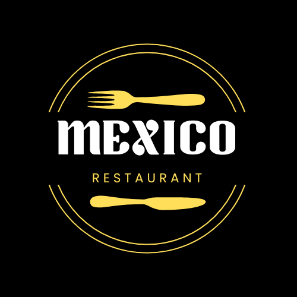
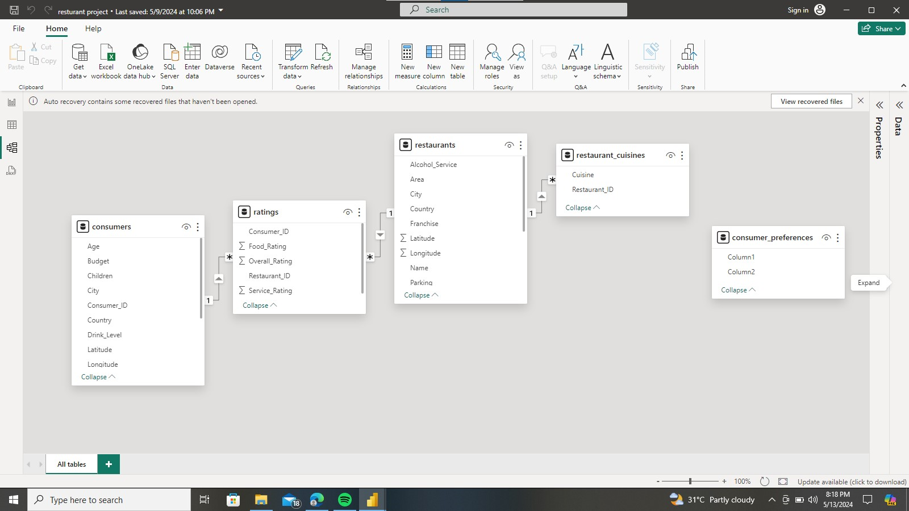
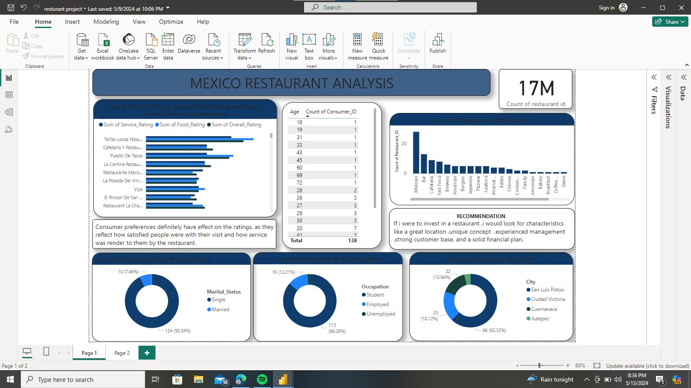

# Mexico Restaurant Analysis

---------
## Introduction
This data set is called the restaurant rating dataset which contains information about restaurants inmexico. A customer survey was carried out in this city in 2012 to collate information about each restaurant, their cuisines, information about their consumers and the preferences of the consumers.
 
**_Disclaimer_** : _ All this datasets and report do not represent any company,institution or country ,but just a dummy dataset to demonstrate capabilities of power BI. _
 
## Problem Statement
 
 
1. What can you learn from the highest rated restaurants? Do consumer preferences have an effect on
ratings?
 
2. What are the consumer demographics? Does this indicate a bias in the data sample?
 
3. Are there any demand & supply gaps that you can exploit in the market?
 
4. If you were to invest in a restaurant, which characteristics would you be looking for?
 
## Skills/Concept demonstated
The following Power BI features were incorporated
- Bookmarking,
- Dax,
- Quick measures,
- Page navigation,
- Modeling,
- Filter,
- Tooltips,

 
   ## Modeling :
   Automatically derived relationships are adjusted to remove and replace unwanted relationships with the require.
   The model is a schema.
   They are 4-dimension tables and 1 fact table. The dimension tables are all joined to the fact table with a one-to-many-relationship.
 
   
   
 
   ## Visualization :
The project consist of 1 page 
- Restaurant report and it is an interactive dataset.
  

------------
## Conclusion/Recommendation
- The count id of the restaurant is 17 million.
- Tortas locas restaurant has the overall rating service because they render the best customer services to their amiable customers.
- count of customer_id by marital_status,the single people has the highest of about 92.54%
- count of customer_id by occupation ,student has the highest of about 86.26%

  **_Recommendation** _
  looking into the dataset deeply ,when it comes to customer service the restaurants should be able to give the customer premium treatment,because if they are satisfy the customers/consumers will keep coming back and that will increase the sales of their restaurant.
 
